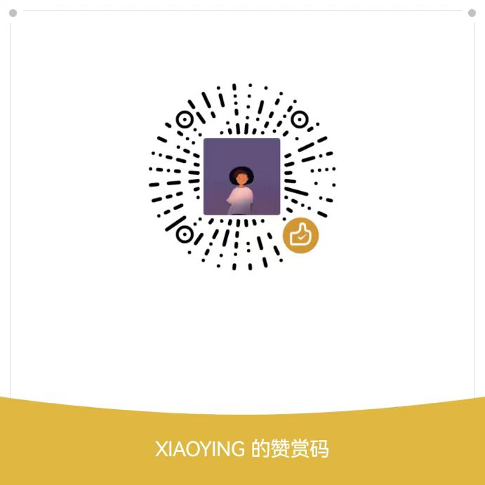

# 蛙噻！好摊 - 摆摊模拟器

一款融合了摆摊经营、RPG战斗、装备收集的放置类游戏。

## 游戏特色

### 核心玩法
- **自动战斗系统**：自动打怪、击败BOSS、解锁新地区
- **摆摊经营**：收集食材、制作料理、摆摊赚钱
- **装备系统**：收集套装装备、强化精炼、提升战力
- **成就系统**：完成成就解锁新内容

### 游戏系统

#### 战斗系统
- 自动战斗，无需手动操作
- 每击败10只怪物出现BOSS
- 击败BOSS后自动前往下一地区
- 死亡后自动返回上一地区并使用药品复活

#### 装备系统
- 7种装备槽位：武器、盔甲、头盔、护腿、手套、鞋子、工具
- 套装系统：2件套/5件套效果
- 精炼系统：+1到+15，每级+4%属性，最高+60%
- 随机属性：装备随机获得1种基础属性加成

#### 地区系统
- 池塘（Lv.1）- 新手区域
- 森林（Lv.2）- 中级挑战
- 山洞（Lv.10）- 高级副本
- 城堡（Lv.15）- 终极挑战

#### 食材收集
- 收集虫子、苹果、香蕉、西瓜等食材
- 制作虫虫串、咻咻辣辣串等料理
- 摆摊出售赚取金币

## 如何游玩

1. 打开游戏后自动开始战斗
2. 击败怪物获得经验和金币
3. 收集食材制作料理
4. 摆摊出售赚取金币
5. 购买装备提升战力
6. 击败BOSS解锁新地区

## 技术栈

- **前端**：HTML5, CSS3, JavaScript (ES6+)
- **存储**：LocalStorage 本地存档
- **部署**：GitHub Pages

## 在线游玩

[点击这里开始游戏](https://xiaoxingdelabi1.github.io/wasaihaotan/)

## 开发者

- 作者：xiaoxingdelabi1
- 联系方式：3103469342@qq.com

## 版权声明

```
蛙噻！好摊 - 摆摊模拟器

版权所有 (C) 2026 
保留所有权利。

本软件受著作权法保护。未经作者书面许可，不得：
- 复制、修改、分发本软件
- 将本软件用于商业目的
- 去除或修改本版权声明

个人使用许可：您可以自由游玩和分享本游戏链接
```

## 更新日志

### v1.4.1 (2026-03-19)
- **蛙百科链接**：底部导航"蛙百科"链接跳转到游戏百科页面 `https://xiaoxingdelabi1.github.io/wabaike/`

### v1.4.0 (2026-03-18)
- **虫子回血增强**：虫子回血量从1点提升至10点
- **虫虫串回血增强**：虫虫串回血量从15点提升至150点
- **咻咻辣辣串回血增强**：咻咻辣辣串回血量从50点提升至500点
- **辣椒容量提升**：辣椒背包容量从10提升至60
- **池塘难度降低**：池塘所有怪物属性降低，提升新手体验
- **死亡机制优化**：死亡后返回上一副本从头开始刷，而非继续当前战斗
- **装备掉落调整**：小BOSS 2%概率掉落装备，大BOSS 5%概率掉落装备
- **掉落预览优化**：小BOSS/大BOSS掉落预览显示对应套装名称
- **地区切换修复**：修复地区下拉框不显示的问题
- **地区重刷保存**：修复地区重刷次数无法保存的bug

### v1.3.0 (2026-03-17)
- **战斗状态保存**：自动战斗暂停状态现在会被保存，刷新页面后保持暂停
- **战斗信息保存**：刷新页面后会继续之前的战斗，保持怪物血量等信息
- **信息UI优化**：添加市价显示，所有价格统一标黄色 (#E6B422)
- **背包UI优化**：物品名称统一标蓝色，tooltip复用统一逻辑
- **集市优化**：价格波动时不再闪烁，tooltip显示更稳定
- **代码优化**：统一所有UI的tooltip绑定逻辑，移除调试信息

### v1.2.0 (2026-03-16)
- **自动化系统优化**：简化为工具卡片，点击启动/停止，绿色进度圈动画
- **捕虫功能迁移**：捕虫网捕虫功能移至自动化页面，食材收集页面移除相关按钮
- **自动上架修复**：修复价格过滤逻辑，支持装备自动上架
- **画布拖动**：自动化页面支持空白处拖动移动画布
- **Bug修复**：修复卡片拖动和点击停止的问题

### v1.1.0 (2026-03-15)
- **自动化系统重构**：可视化卡片连接系统，支持右键添加卡片、拖拽连线
- **工具系统**：工具独立页面，支持最多5个工具槽位，移除耐久度限制
- **角色信息增强**：添加战斗力和生存力显示
- **自动用药优化**：动态识别治疗物品，战斗结束后自动恢复
- **背包修复**：修复溢出问题，卸下装备不再检查背包空间
- **UI优化**：提示文字居中显示，添加缩放和重置视图功能

### v1.0.0 (2026-03-14)
- 实现自动战斗系统
- 添加BOSS战和地区解锁
- 完善装备系统和套装效果
- 优化UI界面和用户体验
- 添加死亡复活机制

## 许可证

本项目仅供个人学习和娱乐使用，禁止商业用途。详见 [LICENSE](LICENSE) 文件。

## 赞赏支持

如果这个游戏给你带来了快乐，欢迎赞赏支持，你的支持是我更新的最大动力！❤️


